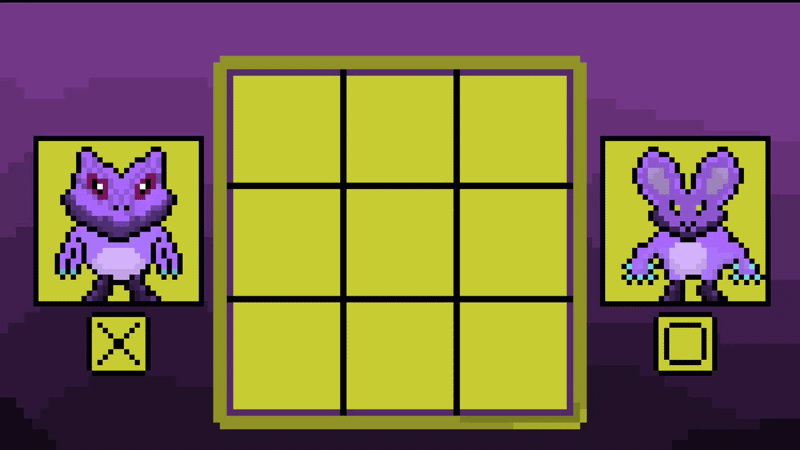
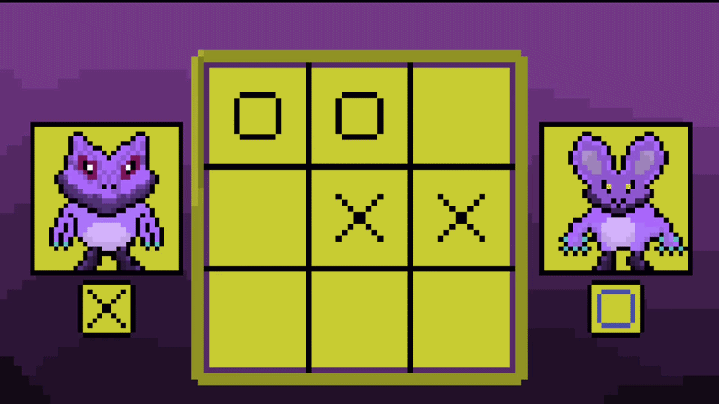
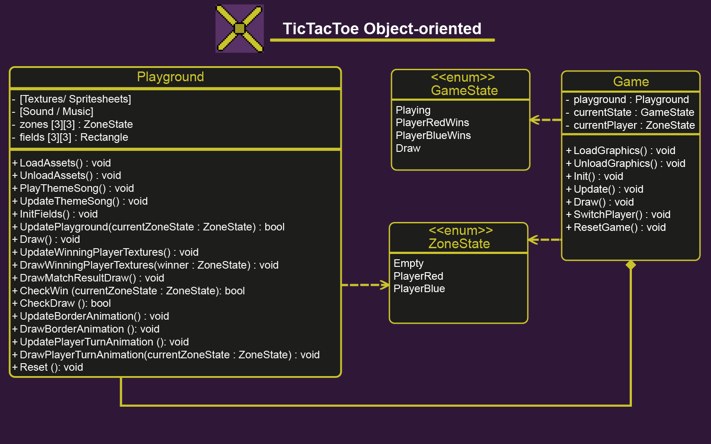

# TicTacToe

A small local two-player Tic-Tac-Toe game developed in C++ using raylib.

The project was created as a learning project to practice object-oriented
programming, game states, animations, audio, and general game logic.

## Gameplay

The active player is highlighted with an animated turn indicator.
The playground also uses a sprite-based border animation.

## Win & Draw Animations

Winning and draw states use animated spritesheets before the match can
be restarted.

## Features

- Local two-player gameplay
- Player1 and Player2 player
- Alternating player turns
- 3x3 clickable playing field
- Horizontal, vertical and diagonal win detection
- Draw detection
- Match restart with Enter or left mouse button
- Animated player turn indicators
- Animated playground border
- Animated winning/draw screen
- Mark placement sound
- Winning sound
- Background music
- Custom window icon
- Custom pixel-art graphics

## Project Structure

The project uses an object-oriented structure with two main classes.

### Class Diagram

### Game
`Game` manages the general game flow, including:

- Current game state
- Current player
- Switching between players
- Win and draw states
- Resetting a match
- Communication with the Playground object

### Playground

`Playground` manages the playing field and its assets, including:

- 3x3 field rectangles
- Zone states
- Player marks
- Win detection
- Draw detection
- Textures and spritesheets
- Animations
- Sounds and music
- Drawing the playground
- Resetting playground-related values

## ZoneStates
The game uses different states to manage the single zone status.

enum class ZoneState { 
    Empty,
    PlayerRed,
    PlayerBlue
};

## GameStates  

The game uses different states to control the current situation of the match.

enum class GameState
{
    Playing,
    PlayerRedWins,
    PlayerBlueWins,
    Draw
};

## Built With

- C++17
- raylib
- Aseprite
- Visual Studio Code
- Git / GitHub

## Learning Goals

This project was created to practice and improve my understanding of:

- Object-oriented programming in C++
- Classes and member variables
- Separation of responsibilities between classes
- Enums and game states
- 2D arrays
- Collision detection
- Update and draw logic
- Spritesheet animations
- Sound and music
- Loading and unloading assets
- Git and GitHub    